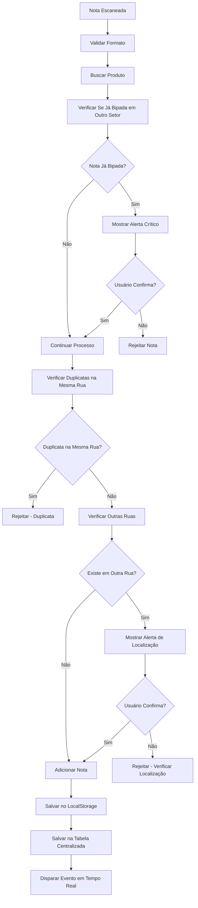

# Verificação de Notas Já Bipadas no Setor de Inventário

## Resumo da Funcionalidade

O sistema de inventário agora inclui uma **verificação crítica** que detecta automaticamente se uma nota fiscal já foi bipada em algum outro setor antes de permitir sua inclusão no inventário.

## Como Funciona

### 1. Verificação Automática
Quando uma nota é escaneada no setor de inventário, o sistema:

1. **Valida o formato** do código de barras
2. **Verifica se a nota já foi bipada** no setor de embalagem:
   - **ALERTA CRÍTICO**: Apenas para notas na tabela `embalagem_notas_bipadas`
   - **Permitido**: Bipagem de notas de outros setores (recebimento, custos, etc.)
   - **Objetivo**: Evitar duplicação entre embalagem e inventário

### 2. Alertas e Confirmações

#### 🚨 ALERTA CRÍTICO - Nota Já Bipada no Setor de Embalagem
```
🚨 ALERTA CRÍTICO!

NOTA JÁ FOI BIPADA NO SETOR DE EMBALAGEM!

NF: 000068310
Código: 45868|000068310|0014|RJ08|EMS S/A|SAO JO|ROD
Rua Atual: A01
Colaborador que bipou: João Silva
Data/Hora: 2024-01-15T10:30:00Z

NF 000068310 já foi bipada no carro CAR001 do setor de embalagem

Esta nota já foi processada na embalagem.
Verifique se não há erro de localização!

Deseja continuar mesmo assim?

• OK = Adicionar no inventário
• Cancelar = Rejeitar (verificar localização)
```

#### 🚨 ALERTA CRÍTICO - Nota Já Existe em Outra Rua
```
🚨 ALERTA CRÍTICO!

NOTA JÁ EXISTE EM OUTRA RUA!

NF: 000068310
Código: 45868|000068310|0014|RJ08|EMS S/A|SAO JO|ROD
Rua Atual: A01
Rua Anterior: B02

Esta nota já foi escaneada na rua B02.
Verifique se não há erro de localização!

Deseja continuar mesmo assim?

• OK = Adicionar na rua atual
• Cancelar = Rejeitar (verificar localização)
```

#### ❌ NOTA DUPLICADA - Mesma Rua
```
❌ NOTA DUPLICADA!

NF: 000068310
Código: 45868|000068310|0014|RJ08|EMS S/A|SAO JO|ROD
Rua: A01

Esta nota fiscal já foi escaneada nesta rua.
Notas duplicadas não são permitidas no inventário.
```

## Implementação Técnica

### Serviço Criado
- **Arquivo**: `lib/inventario-notas-bipadas-service.ts`
- **Classe**: `InventarioNotasBipadasService`

### Métodos Principais

#### 1. `verificarNotaJaBipada(codigoCompleto: string)`
Verifica se uma nota já foi bipada no setor de embalagem:

```typescript
const verificarNota = await InventarioNotasBipadasService.verificarNotaJaBipada(codigo.trim());

if (verificarNota.success && verificarNota.jaBipada) {
  // Nota já foi bipada - mostrar alerta
  const setorInfo = verificarNota.setorInfo;
  // ... lógica de confirmação
}
```

#### 2. `salvarNotaBipada(notaBipada: InventarioNotaBipada)`
Salva a nota bipada na tabela centralizada:

```typescript
await InventarioNotasBipadasService.salvarNotaBipada(notaBipada);
```

### Tabelas Utilizadas

#### 1. `embalagem_notas_bipadas`
- **ALERTA CRÍTICO**: Verifica se a nota foi bipada no setor de embalagem
- Busca por `codigo_completo` (sem filtro de status)
- **Única tabela** que gera alerta crítico

#### 2. `notas_bipadas`
- **Não gera alerta**: Usada apenas para salvamento das notas do inventário
- Armazena todas as notas bipadas em todos os setores

## Fluxo de Validação



## Benefícios da Implementação

### 1. **Prevenção de Erros**
- Detecta notas já processadas em outros setores
- Evita duplicação de trabalho
- Identifica possíveis erros de localização

### 2. **Rastreabilidade**
- Todas as notas bipadas são salvas na tabela centralizada
- Histórico completo de processamento
- Auditoria de operações

### 3. **Segurança Operacional**
- Alertas visuais claros para situações críticas
- Confirmação do usuário antes de prosseguir
- Logs detalhados de todas as operações

### 4. **Integração com Outros Setores**
- Verificação cruzada entre setores
- Dados sincronizados em tempo real
- Sistema unificado de controle

## Configuração e Uso

### 1. **Importar o Serviço**
```typescript
import { InventarioNotasBipadasService } from "@/lib/inventario-notas-bipadas-service";
```

### 2. **Verificar Antes de Processar**
```typescript
const verificarNota = await InventarioNotasBipadasService.verificarNotaJaBipada(codigo);
if (verificarNota.jaBipada) {
  // Tratar nota já bipada
}
```

### 3. **Salvar Após Processamento**
```typescript
await InventarioNotasBipadasService.salvarNotaBipada(notaBipada);
```

## Monitoramento e Logs

### Console Logs
- `🔍 Verificando se nota já foi bipada em algum setor...`
- `⚠️ Nota já foi bipada no setor de embalagem`
- `✅ Nota não foi bipada em nenhum setor`
- `✅ Nota bipada salva na tabela centralizada`

### Eventos em Tempo Real
- `inventory_updated` - Nota processada
- `ja_bipada_outro_setor` - Nota rejeitada por já estar em outro setor
- `erro_localizacao` - Possível erro de localização
- `duplicata_rejeitada` - Duplicata na mesma rua

## Considerações de Performance

### 1. **Índices de Banco**
- `codigo_completo` na tabela `embalagem_notas_bipadas`
- `codigo_completo` na tabela `notas_bipadas`
- `area_origem` na tabela `notas_bipadas`

### 2. **Cache Local**
- Verificações são feitas no banco apenas quando necessário
- Dados locais são mantidos para operações offline
- Sincronização automática quando conectado

### 3. **Retry com Backoff**
- Tentativas automáticas em caso de falha de conexão
- Fallback para localStorage quando offline
- Recuperação automática de erros

## Manutenção e Suporte

### 1. **Logs de Erro**
- Todos os erros são logados no console
- Eventos de erro são disparados para monitoramento
- Fallbacks garantem continuidade da operação

### 2. **Atualizações**
- Serviço pode ser facilmente estendido
- Novos setores podem ser adicionados
- Validações podem ser customizadas

### 3. **Testes**
- Métodos podem ser testados individualmente
- Cenários de erro são cobertos
- Validações são robustas
